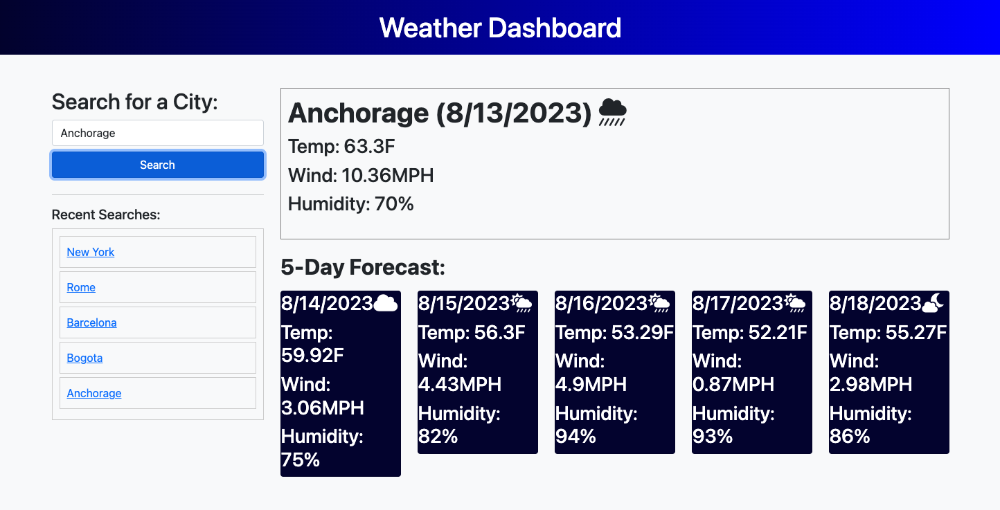

# Weather_Dashboard

## Description

This project was created to build a weather dashboard using the OpenWeather API. 

This app runs in the browser, and features dynamically updated HTML and CSS.

The user is able to click on a city in the search history list and the weather for that city will be provided.

## Installation

N/A

## Usage

The URL to the page is 

Search for a city and get a view of the current weather conditions (date, temperature, weather icon, wind and humidity) for that city and its 5-day forecast. 

## License

Please refer to the LICENSE in the repository.

## Note

This project was created based on reviewing activities from the previous classes at bootcamp and Google searches.

